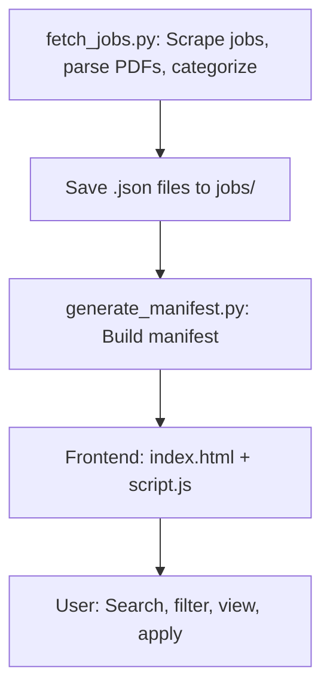

# 🇮🇳 SarkariSarthi – Free Govt Job Portal

SarkariSarthi is a fully automated, free-to-host static Indian Government Job Portal.  
Built with **Python**, **BeautifulSoup**, **GitHub Actions**, and **Pico.css** – this site auto-fetches real jobs from UPSC and will support more sources soon.

## ✅ Features

---

## 🛠️ How it works

- Real-time scraping from **UPSC**
- Auto-delete expired jobs
- Filters + search bar
- Hosted on GitHub Pages
- SEO + AdSense Ready

## 🌏 Deploy at:
https://parya5103.github.io/SarkariSarthi/

---

## 🤝 Contributing

1. Fork this repo and clone your fork.
2. Create a new branch for your feature or bugfix.
3. Run `pip install -r requirements.txt` (and optionally `pytest` for tests).
4. Make your changes and submit a pull request!

See [CONTRIBUTING.md](CONTRIBUTING.md) for more.
